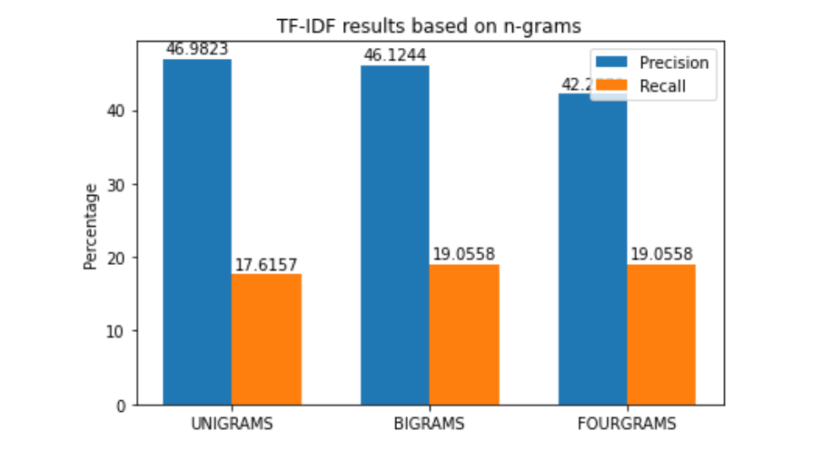
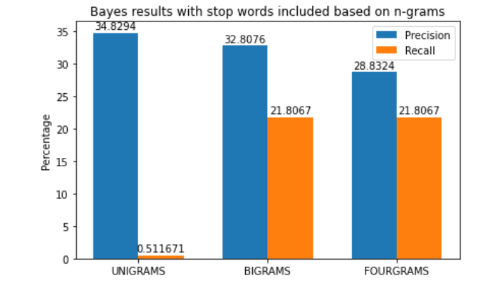
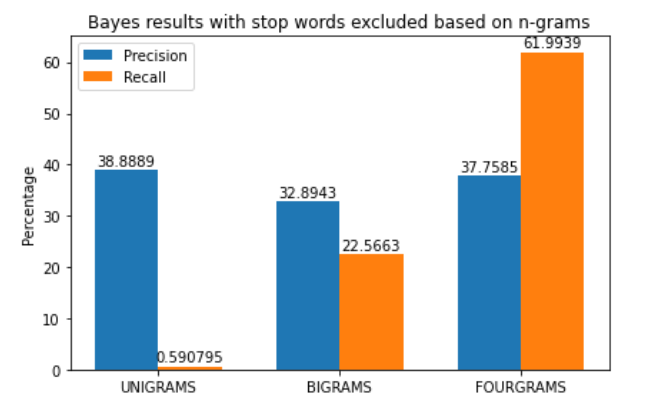

## Table of Contents

- **[Introduction](#introduction)**
- **[Execution Results](#execution_results)**
  - [TF-IDF](#tf_idf)
  - [Bayes](#bayes)
    - [Stop words included](#stop_words_included)
    - [Stop words excluded](#stop_words_excluded)

## About the game

## Execution Results

### TF-IDF

  

  

### Bayes

#### With stop words included

  

  

#### With stop words excluded

  

  
